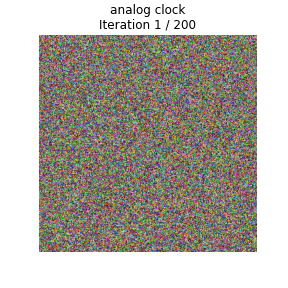
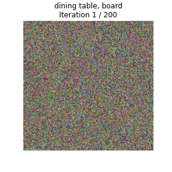
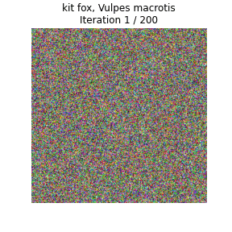
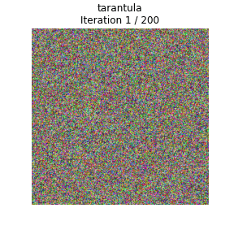
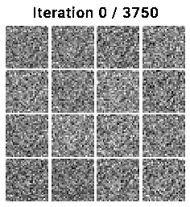
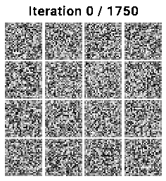

# Deep Learning for Computer Vision Courses

## General info

I present my assignment solutions for both 2020 course offerings: **Stanford University CS231n** (CNNs for Visual Recognition) and **University of Michigan EECS 498-007/598-005** (Deep Learning for Computer Vision).

### Review

After reading enormous positive reviews about CS231n, I decided to dive in by myself into the course lectures which, as expected, were great with well-presented and explained topics (thanks to the instructors) that covers a plethora of Machine Learning / Deep Learning concepts (not only computer vision related), theoretically (via lectures, slides and extra reading content) and practically (via the well-designed assignments).

Depending on your ML understanding (especially, statistics, algebra and Python programming with NumPy package) this course can be challenging since the topics are covered from the fundamentals (actually, from scratch, going through all the math behind). Even me, having a mathematical background, I found myself struggled with some advanced topics (like Variational Autoencoders), which pushed me to review some maths/stats formulas. That being said, most of the course materials aren't that difficult and even so, all the putted efforts and spent time are totally worth it, you will learn a lot.

In parallel to CS231n, I took also its Michigan's updated equivalent EECS 498-007 (abbreviated, as there is a lot of numbers in the course's title), because:

- For CS231n, only 2016 and 2017 lectures are available, which is a little bit old given the fast progress in ML in general. However, this concerns only some topics and even that, the old lectures are still worthy to watch.

- For EECS 498-007, the 2019 lectures are available. They cover more topics (like Attention, 3D, Video, etc.), and the ones existing in CS231n are updated, and some topics are explained in more detail (like Object detection and VAEs). This novelty concerns also the assignments.

The similarity between the two courses is related to the fact that one of CS231n's main instructors (precisely, Justin Johnson) moved from Stanford to Michigan in 2019.

### Assignments

Assignments are the funniest part of the courses, they allow practicing most of the learned theoretical concepts. That is, you will implement vectorized mathematical formulas, gradient descent (be prepared to spend some hours with a pen and a sheet figuring out how to compute formula gradients), neural networks (among others: CNNs and RNNs) from scratch, etc. . That being said, in advanced assignment parts, you will also use high-level frameworks: TensorFlow and PyTorch.

Assignment questions are in form of Jupyter notebooks that call external Python files in order to execute properly. That is, you will mostly implement missing parts in the Python files and execute notebook's cells to check the correctness of your implementation. However, you'll write also some code in the notebooks and respond to inline questions (result analysis and theoretical questions).

For my implementation, I solved all from the three CS231n assignments, for the questions that use frameworks, they ask to pick only one, and for that I choosed PyTorch. That is, questions that require framework were implemented with PyTorch (and not with TensorFlow). For EECS 498-007, since its assignments are similar to the CS231n ones, I solved only those who bring new concepts, precisely A4 (partially, the first two questions about Residual Networks and Attention LSTM), A5 (Object detection: YOLO and Faster RCNN) and A6 (partially, the 1st question about VAEs). For EECS 498-007, there is no choice, only PyTorch is used (which fits perfectly with my choice of using it also in CS231n).

Note that, even that my coding solutions are probably correct, the CS231n assignments contain inline questions for which I'm not sure about their correctness, I just responded as well as I know. Also, Except for the CS231n first assignment (which is less commented), for the remaining assignments, I tried to comment on my code as richly as I can to make it understandable.

### Repository Structure

The repository file's structure is quite intuitive, there are two folders (one for each course), each one with its sub-folders that represent the assignments (three for both, CS231n and EECS 498-007). Note that for each assignment's folder, I put a README which shows covered topics and question descriptions (copied from the assignment's website).

In the rest of this README, I will present a [quick access to the assignments files](#assignment-files), [useful links](#useful-links), some [obtained results](#result-examples) and [credits](#credits).

### Courses' Materials Links

The table below shows relevant links to both courses' materials.

| Relevent info | CS231n | EECS 498-007 |
|:-:|:-:|:-:|
| Official website | [[2020]](http://cs231n.stanford.edu/2020/index.html), [[2017]](http://cs231n.stanford.edu/2017/index.html)  | [[2020]](https://web.eecs.umich.edu/~justincj/teaching/eecs498/FA2020/), [[2019]](https://web.eecs.umich.edu/~justincj/teaching/eecs498/FA2019/) |
| Lectures playlist | [[2017]](https://www.youtube.com/playlist?list=PL3FW7Lu3i5JvHM8ljYj-zLfQRF3EO8sYv), [[2016]](https://www.youtube.com/playlist?list=PLkt2uSq6rBVctENoVBg1TpCC7OQi31AlC) | [[2019]](https://www.youtube.com/playlist?list=PL5-TkQAfAZFbzxjBHtzdVCWE0Zbhomg7r) |
| Syllabus | [[2020]](http://cs231n.stanford.edu/2020/syllabus.html), [[2017]](http://cs231n.stanford.edu/2017/syllabus) | [[2020]](https://web.eecs.umich.edu/~justincj/teaching/eecs498/FA2020/schedule.html), [[2019]](https://web.eecs.umich.edu/~justincj/teaching/eecs498/FA2019/schedule.html) |

## Assignment Files

### CS231n: Convolutional Neural Networks for Visual Recognition

#### Assignment 1

**Modified Python files:** [``k_nearest_neighbor.py``](cs231n/assignment1/cs231n/classifiers/k_nearest_neighbor.py), [``linear_classifier.py``](cs231n/assignment1/cs231n/classifiers/linear_classifier.py), [``linear_svm.py``](cs231n/assignment1/cs231n/classifiers/linear_svm.py), [``softmax.py``](cs231n/assignment1/cs231n/classifiers/softmax.py), [``neural_net.py``](cs231n/assignment1/cs231n/classifiers/neural_net.py).

| Question |                     Title                    |                          IPython Notebook                         |
|:--------:|:--------------------------------------------:|:-----------------------------------------------------------------:|
|    Q1    |         k-Nearest Neighbor classifier        |           [``knn.ipynb``](cs231n/assignment1/knn.ipynb)           |
|    Q2    |       Training a Support Vector Machine      |           [``svm.ipynb``](cs231n/assignment1/svm.ipynb)           |
|    Q3    |        Implement a Softmax classifier        |       [``softmax.ipynb``](cs231n/assignment1/softmax.ipynb)       |
|    Q4    |           Two-Layer Neural Network           | [``two_layer_net.ipynb``](cs231n/assignment1/two_layer_net.ipynb) |
|    Q5    | Higher Level Representations: Image Features |      [``features.ipynb``](cs231n/assignment1/features.ipynb)      |

#### Assignment 2

**Modified Python files:** [``layers.py``](cs231n/assignment2/cs231n/layers.py), [``optim.py``](cs231n/assignment2/cs231n/optim.py), [``fc_net.py``](cs231n/assignment2/cs231n/classifiers/fc_net.py), [``cnn.py``](cs231n/assignment2/cs231n/classifiers/cnn.py).

| Question |               Title              |                                  IPython Notebook                                 |
|:--------:|:--------------------------------:|:---------------------------------------------------------------------------------:|
|    Q1    |  Fully-connected Neural Network  |    [``FullyConnectedNets.ipynb``](cs231n/assignment2/FullyConnectedNets.ipynb)    |
|    Q2    |        Batch Normalization       |    [``BatchNormalization.ipynb``](cs231n/assignment2/BatchNormalization.ipynb)    |
|    Q3    |              Dropout             |               [``Dropout.ipynb``](cs231n/assignment2/Dropout.ipynb)               |
|    Q4    |      Convolutional Networks      | [``ConvolutionalNetworks.ipynb``](cs231n/assignment2/ConvolutionalNetworks.ipynb) |
|    Q5    | PyTorch / TensorFlow on CIFAR-10 |               [``PyTorch.ipynb``](cs231n/assignment2/PyTorch.ipynb)               |

#### Assignment 3

**Modified Python files:** [``rnn_layers.py``](cs231n/assignment3/cs231n/rnn_layers.py), [``rnn.py``](cs231n/assignment3/cs231n/classifiers/rnn.py), [``net_visualization_pytorch.py``](cs231n/assignment3/cs231n/net_visualization_pytorch.py), [``style_transfer_pytorch.py``](cs231n/assignment3/cs231n/style_transfer_pytorch.py), [``gan_pytorch.py``](cs231n/assignment3/cs231n/gan_pytorch.py).

| Question |                Title               |                                                    IPython Notebook                                                   |
|:--------:|:----------------------------------:|:---------------------------------------------------------------------------------------------------------------------:|
|    Q1    | Image Captioning with Vanilla RNNs |                          [``RNN_Captioning.ipynb``](cs231n/assignment3/RNN_Captioning.ipynb)                          |
|    Q2    |     Image Captioning with LSTMs    |                         [``LSTM_Captioning.ipynb``](cs231n/assignment3/LSTM_Captioning.ipynb)                         |
|    Q3    |        Network Visualization       |            [``NetworkVisualization-PyTorch.ipynb``](cs231n/assignment3/NetworkVisualization-PyTorch.ipynb)            |
|    Q4    |           Style Transfer           |                   [``StyleTransfer-PyTorch.ipynb``](cs231n/assignment3/StyleTransfer-PyTorch.ipynb)                   |
|    Q5    |   Generative Adversarial Networks  | [``Generative_Adversarial_Networks_PyTorch.ipynb``](cs231n/assignment3/Generative_Adversarial_Networks_PyTorch.ipynb) |

### EECS 498-007 / 598-005: Deep Learning for Computer Vision

#### Assignment 4

**Modified Python files:** [``pytorch_autograd_and_nn.py``](eecs498-007/A4/pytorch_autograd_and_nn.py), [``rnn_lstm_attention_captioning.py``](eecs498-007/A4/rnn_lstm_attention_captioning.py), [``network_visualization.py``](eecs498-007/A4/network_visualization.py), [``style_transfer.py``](eecs498-007/A4/style_transfer.py).

| Question |                      Title                      |                                        IPython Notebook                                       |
|:--------:|:-----------------------------------------------:|:---------------------------------------------------------------------------------------------:|
|    Q1    |                 PyTorch Autograd                |       [``pytorch_autograd_and_nn.ipynb``](eecs498-007/A4/pytorch_autograd_and_nn.ipynb)       |
|    Q2    | Image Captioning with Recurrent Neural Networks | [``rnn_lstm_attention_captioning.ipynb``](eecs498-007/A4/rnn_lstm_attention_captioning.ipynb) |
|    Q3    |              Network Visualization              |         [``network_visualization.ipynb``](eecs498-007/A4/network_visualization.ipynb)         |
|    Q4    |                  Style Transfer                 |                [``style_transfer.ipynb``](eecs498-007/A4/style_transfer.ipynb)                |

#### Assignment 5

**Modified Python files:** [``single_stage_detector.py``](eecs498-007/A5/single_stage_detector.py), [``two_stage_detector.py``](eecs498-007/A5/two_stage_detector.py).

| Question |         Title         |                                         IPython Notebook                                        |
|:--------:|:---------------------:|:-----------------------------------------------------------------------------------------------:|
|    Q1    | Single-Stage Detector |     [``single_stage_detector_yolo.ipynb``](eecs498-007/A5/single_stage_detector_yolo.ipynb)     |
|    Q2    |   Two-Stage Detector  | [``two_stage_detector_faster_rcnn.ipynb``](eecs498-007/A5/two_stage_detector_faster_rcnn.ipynb) |

#### Assignment 6

**Modified Python files:** [``vae.py``](eecs498-007/A6/vae.py), [``gan.py``](eecs498-007/A6/gan.py).

| Question |              Title              |                                          IPython Notebook                                         |
|:--------:|:-------------------------------:|:-------------------------------------------------------------------------------------------------:|
|    Q1    |     Variational Autoencoder     |        [``variational_autoencoders.ipynb``](eecs498-007/A6/variational_autoencoders.ipynb)        |
|    Q2    | Generative Adversarial Networks | [``generative_adversarial_networks.ipynb``](eecs498-007/A6/generative_adversarial_networks.ipynb) |

## Useful Links

The list below provides the most useful external resources that helped me to clarify and understand deeply some ambiguous topics encountered in the lectures. Note that those are only the most important ones, that is, completely understanding them will maybe require checking other -not mentioned- resources.

- Convolutional Neural Networks (CNNs).
  - CNNs implementation from scratch in Python [[Part 1]](https://victorzhou.com/blog/intro-to-cnns-part-1/) [[Part 2]](https://victorzhou.com/blog/intro-to-cnns-part-2/).
  - [A guide to receptive field arithmetic for CNNs](https://medium.com/mlreview/a-guide-to-receptive-field-arithmetic-for-convolutional-neural-networks-e0f514068807).

- Normalization layers.
  - [Understanding the backward pass through Batch Normalization Layer](https://kratzert.github.io/2016/02/12/understanding-the-gradient-flow-through-the-batch-normalization-layer.html) (Staged computation method).
  - [Deriving the Gradient for the Backward Pass of Batch Normalization](https://kevinzakka.github.io/2016/09/14/batch_normalization/) (Gradient derivation method).
  - [Group Normalization - The paper](https://arxiv.org/abs/1803.08494) (Concept and implementation well explained).

- Principal Component Analysis (PCA).
  - [Principal Component Analysis (PCA) from Scratch](https://drscotthawley.github.io/blog/2019/12/21/PCA-From-Scratch.html) (Covariance matrix method).
  - StatQuest: PCA (SVD Decomposition method) [[Part 1]](https://youtu.be/FgakZw6K1QQ) [[Part 2]](https://youtu.be/oRvgq966yZg).
  - [In Depth: Principal Component Analysis](https://jakevdp.github.io/PythonDataScienceHandbook/05.09-principal-component-analysis.html) (Using Sklearn package).

- Object Detection.
  - [mAP (mean Average Precision) for Object Detection](https://jonathan-hui.medium.com/map-mean-average-precision-for-object-detection-45c121a31173).
  - Object Detection for Dummies [[Part 1]](https://lilianweng.github.io/lil-log/2017/10/29/object-recognition-for-dummies-part-1.html) [[Part 2]](https://lilianweng.github.io/lil-log/2017/12/15/object-recognition-for-dummies-part-2.html) [[Part 3]](https://lilianweng.github.io/lil-log/2017/12/31/object-recognition-for-dummies-part-3.html) [[Part 4]](https://lilianweng.github.io/lil-log/2018/12/27/object-detection-part-4.html).

- Variational Autoencoders (VAEs).
  - [Kullback-Leibler (KL) Divergence Explained](https://www.countbayesie.com/blog/2017/5/9/kullback-leibler-divergence-explained).
  - [Variational autoencoders](https://www.jeremyjordan.me/variational-autoencoders/).
  - [Variational Autoencoder Demystified With PyTorch Implementation](https://towardsdatascience.com/variational-autoencoder-demystified-with-pytorch-implementation-3a06bee395ed).

- Generative Adversarial Networks (GANs).
  - [GANs from Scratch: A deep introduction, with code in PyTorch](https://medium.com/ai-society/gans-from-scratch-1-a-deep-introduction-with-code-in-pytorch-and-tensorflow-cb03cdcdba0f).
  - [GAN objective function origin explanation](https://ai.stackexchange.com/a/13038).
  - [Google DeepMind: Generative Adversarial Networks](https://youtu.be/wFsI2WqUfdA).

## Result Examples

As mentioned previously, assignments are the funniest part of the courses. In this section, I will provide some interesting obtained results. That being said, during assignment solving, you will encounter other amazing results, here I just picked some of them.

### Class Visualization

Consists of generating a synthetic image that will maximize some class score. Illustrations shown below are generated by applying this technique on a pre-trained CNN on ImageNet dataset. You can see the changes on the synthetic image during training for different classes (categories). Even that those images are not understandable (because they are supposed to maximize scores, not to be pretty) you can identify some specific patterns/shapes for these particular classes.

|  |  |  |  |
|:------------------------------------------:|:------------------------------------------:|:--------------------------------:|:------------------------------------:|
|                Analog Clock                |                Dining Table                |              Kit Fox             |               Tarantula              |

### GANs

The goal of Generative Adversarial Networks is to generate novel data (in our case, images) that mimic the original data from a dataset. Illustrations below were generated by training three types of GANs (on left: The most basic one, on right: The most advanced one) on the MNIST dataset. You can see the changes on the generated images during training, from completely noisy to reasonable images (that do not exist in the dataset).

|  |  |
|:----------------------------------------:|:----------------------------:|
|                Vanilla GAN               |             DCGAN            |

### Style Transfer

Consists of applying a style from an artistic drawing on an input image. The illustration below shows the result of applying different styles on two images.

|  |
|:-:|
| Style transfer applied on two images. Drawing credits (from left to the right): [The Scream](https://artsandculture.google.com/asset/the-scream-edvard-munch/eQFdRTFKDtVQ1A), [Bicentennial Print](https://artsandculture.google.com/asset/bicentennial-print-roy-lichtenstein/TAHrv5B7P6vh1A), [Horses on the Seashore](https://artsandculture.google.com/asset/horses-on-the-seashore/-wFNr8bqc58Ghw), [Head of a Clown](https://artsandculture.google.com/asset/head-of-a-clown/CQHMqKf7DRo76w) and [The Starry Night](https://artsandculture.google.com/asset/the-starry-night-vincent-van-gogh/bgEuwDxel93-Pg). |

## Credits

I would like to thank everyone involved, directly or indirectly, for making such a great course freely available for everyone. Especially, the instructors: [Fei-Fei Li](https://profiles.stanford.edu/fei-fei-li), [Andrej Karpathy](https://karpathy.ai/), [Serena Yeung](http://ai.stanford.edu/~syyeung/) and [Justin Johnson](https://web.eecs.umich.edu/~justincj/).
